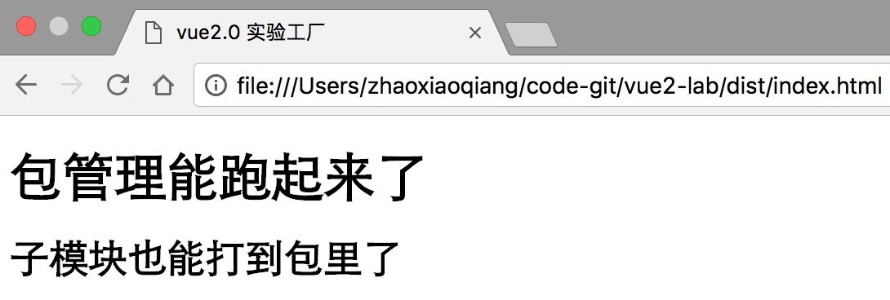

# vue2-lab

> vue2.0 实验室，探索vue从起步到复杂的具体操作流程。

## 从那些依赖开始

要想跑起来一个简单的页面，需要各种工具的辅助，前端早已不是那个写个静态页面就能跑的年代了。

首先是 vue，版本在这里找：[git releases](https://github.com/vuejs/vue/releases)，好最新版：v2.1.4，我们就安装这个。

    npm i vue@2.1.4 --save

然后是 webpack 包管理工具，老办法：[git releases](https://github.com/webpack/webpack/releases)，最新版：v1.14.0。

    npm i webpack@1.14.0 --save

## 一个简单的页面要跑起来

先准备`dist/index.html` 和 `src/index.js`静态文件，我们这一趴只把包管理搞定(这里用的是webpack作为打包工具)。

这里需要 npm 和 webpack 的知识，可以出门右转到[我的博客](https://longze.github.io/#!/)看相关内容。

本来打算像下面这样在脚本里面配置一行脚本搞定打包：

    "scripts": {
        "lab-start": "webpack ./config/webpack.config.start.js"
    }

但是发现行不通，离开了 config 文件夹就玩不转了(知道怎么解决的劳烦告诉一下，红包答谢)。然后查看 vuecli 的源码是用 node 脚本包装了一下搞定的，好我也照猫画虎的搞一下，写一个 node 脚本：

    var webpack = require('webpack');
    var webpackConfig = require('../config/webpack.config');
    
    webpack(webpackConfig, function (err, stats) {
        // 打包完可以干一些事情
    });
    
补上脚本配置：
    
    "scripts": {
        "build-pack": "node ./build/build-pack.js"
    }

终于可以运行一下脚本了：

    run build-pack

运行之后可以看到在 `/dist/` 下面多了一个 `index.js` 文件，恭喜恭喜，终于把包打出来了，直接在浏览器中查看 `dist/index.html`，看到了下面的页面：

[0.0.2.zip](https://github.com/longze/vue2-lab/archive/0.0.2.zip)

## vue 在哪？

博士买驴，书券三纸，未有驴字。谢了这么多还没看见 vue 在项目代码中出现，npm 安装之后要怎么用呢？

这一趴要把vue的组件化搞定。

先把需要的包装上：

    npm i css-loader@0.26.1 --save
    npm i vue-template-compiler@2.1.0 --save
    npm i vue-loader@10.0.0 --save

最简单的 vue 实例，用 render 函数绕过对模板的依赖

    

    
    new Vue({
        el: '#app',
        data: {
            name: 'test'
        },
        render: function (createElement) {
            var html = createElement('div', this.name);
            // 并非是 DOM 节点，无法添加事件
            // html.addEventListener
            return html;
        }
    });

然后我们要把模板用起来，会发现报下面的错误：
    
    Failed to mount component: template or render function not defined.

vue 默认的构建方式是"runtime-only build"，这个版本不包括模板的动态编译功能，这个可能和 vue 的定位有关 -- 主要做好视图和数据的同步更新，为了和模板渲染渲染解耦，将这个功能单独放在了一个地方。这里就有了两种解决方案：
- 用模板和数据生成dom字符串，丢弃模板渲染引擎
- 保留模板渲染引擎，用字符串存放模板，在需要的时候再结合数据生成 dom

第一种方式用在了服务器端渲染，第二种用在了前端异步渲染。解决这个问题的办法是配置别名，使用有模板编译功能的 vue[更多信息](https://vuejs.org/v2/guide/installation.html#Standalone-vs-Runtime-only-Build)：

    resolve: {
        alias: {
            'vue$': 'vue/dist/vue.common.js'
        }
    }

模板的3种用法：

第一种：

html 部分：
    
    

    
    
js 部分：
    
    new Vue({
        el: '#app',
        template: '#template-id',
        data: {
            name: 'test'
        }
    });
    
这种方式适合做简单的 demo 或展示页。
    
第二种，其实是第一种换了个姿势，模板可以通过字符串的形式存在：

    new Vue({
        el: '#app',
        template: '
{{name}}
',
        data: {
            name: 'test'
        }
    });
    
用这种方式可以使用第三方的模板引擎，或者配合 html 片段加载器实现 html 与 js 的分离，这种方案在实现移动端加速 amp 和 mip 可能会用到。当然 vue 提供了自己的分离方案我们下面讲。    

    var template = require('./template.html.tpl');
    new Vue({
        el: '#app',
        template: template,
        data: {
            name: 'test'
        }
    });

第三种，使用 .vue 文件作为一个功能模块：

首先是报这个错找不到 .vue 文件，其实是 loader 没有设置好，需要将 loaders 放在 module 下面，这是不经意间犯得一个错误。还要在 extensions 中添加 ".vue"，部分配置如下：

    module: {
        loaders: []
    }

    resolve: {
        alias: {
            'vue$': 'vue/dist/vue.common.js'
        },
        extensions: ['', '.js', '.vue']
    },

    module: {
        loaders: [
            {
                test: /\.vue$/,
                loader: 'vue'
            }
        ]
    }

.vue 文件的写法整体如下：
 
    <template>
        

            {{name}}
        

    </template>
    
    

到目前为止终于把 vue 组件化用起来了。

## 参考

[Standalone-vs-Runtime-only-Build](https://vuejs.org/v2/guide/installation.html#Standalone-vs-Runtime-only-Build)
    
    